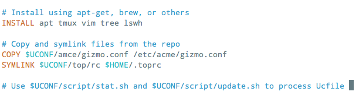

User-Config
===========
:Created: 2015-10-03
:Project:

  .. image:: https://secure.travis-ci.org/dotmpe/user-config.png
    :target: https://travis-ci.org/dotmpe/user-config
    :alt: Build

  .. image:: https://badge.fury.io/gh/dotmpe%2Fuser-config.png
    :target: http://badge.fury.io/gh/dotmpe%2Fuser-config
    :alt: GIT

A dotfile repository.

Intro
-----
It was time to expand a little on my existing dotfile repo setup.
There's probably many out there. But not too many templates or seed projects.

Looked at only a couple and decided I wanted nothing more than bare basics,
so that it would work everywhere: GIT and Sh. Some scripts, maybe some
git-hooks. That's Bourne shell, not ``*sh``.

So I just wrote the minimal scripts to do it. And then started adding some
generic configurations for `tmux`, `vim`, `bash` and others.

There are some Bats tests for the shell lib functions. But not for the UC
scripts themselves. ``$UCONF/test.sh``.

This presents a File format called user-config, or u-c. With a vim-syntax file.
Supports a limited set of initial directives: SYMLINK, COPY for config files,
and INSTALL for binaries.

Install
-------
::

  export UCONF=$HOME/.conf
  git clone --origin tpl git@github.com:dotmpe/user-config.git $UCONF

  cd $UCONF
  htd git-init-remote # git clone bare, rsync, git remote add ...

Guide
------
Each host::

  $UCONF/init.sh

Add file copies using script::

  cd /etc/acme
  $UCONF/script/add.sh gizmo.conf

Or edit ``$UCONF/install/$hostname.conf`` by hand to create symlinks,
and to supply other directives.

To run the directives::

  $UCONF/script/update.sh

Or to dry-run::

  $UCONF/script/stat.sh

The standard directives support ``stat`` and ``update``.
`BASE` and `INSTALL` excepted.

Dev
----
- One file per host seems OK. Keeps args/variables in ucfile down.

  My initial dotfile repo symlinks.tab used hostnames as tags, to filter out
  rules per host. Still an interesting concept. Compare with optional directives.

- Want a directive to specify which command to use to test for installed
  programs, so that INSTALL can be a regular stat/update directive. \
  XXX: BIN directive.

- TODO: make directives optional. Maybe stick an asterix or q-mark to the keyword.
- TODO: badly want git clone directive, also submodule directive. Should be good enough for vim-pathogen. And many other things.
- TODO: a source directive. As new directives are added it should be useful
  create generic bits of ufile with var. directives and distribute ucfiles in bits.

- XXX: an INIT directive, create customized per-host file from boilerplate
- XXX: maybe use installer glob for INSTALL. But would need to map package names
  then too. Should also be useful with SOURCE directive iot generalize.

